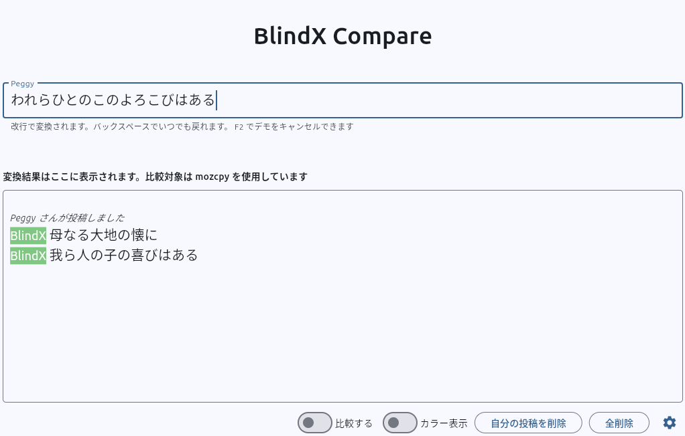

# BlindX Compare

## 実行方法

```
cd BlindX-pub/demo-25.02/apps
flet app0
```
プログラムが起動したら上段にウィンドウのローマ字入力がひらがな変換されて下段に表示されます。
IME をオフの状態で入力してください。IME 経由でも入力した場合は、入力された文章がそのまま出力されます。

- タイプミスはバックスペースでもどれます。
- F1 で自動デモを実行、F2 でキャンセルされます。
- [全削除」あるいは「自分の投稿を削除」で画面をクリアできます。

入力

```
hahanarudaitinofutokoroni [ret]
warerahitonokonoyorokobihaaru [ret]
```

対応する出力

<p align="center">
    
</p>


