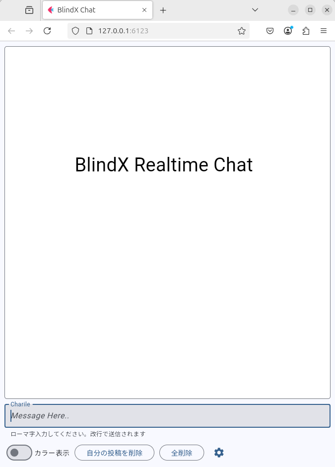
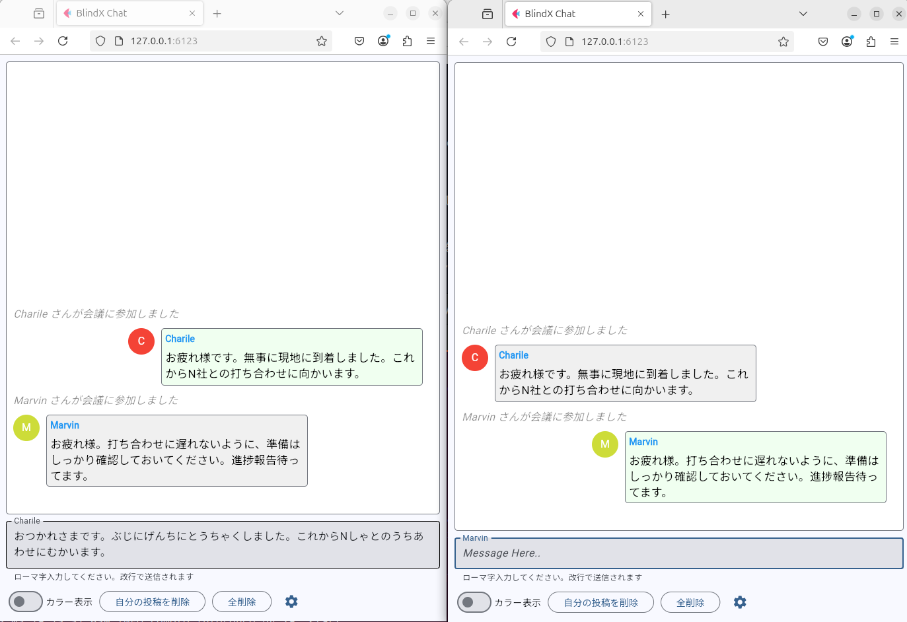

# BlindX Chat

## 実行方法

```
cd BlindX-pub/demo-25.04/apps
flet app1
```

<p align="center">
    
</p>

プログラムが起動したら下段のウィンドウに入力されたローマ字入力が投稿されます。

- タイプミスはバックスペースで過去の投稿に遡ってもどれます。
- F1 で自動デモを実行、F2 でキャンセルされます。
- [全削除」あるいは「自分の投稿を削除」で画面をクリアできます。


## web アプリ

### サーバの起動

```
% cd BlindX-pub/demo-25.04/apps
% flet app1 --web --port 6123
```
ポート番号はここでは 6123 番を指定しています。空いているポートを使用ください。
ctrl-C で終了できます。 

### クライアントの起動

firefox を使う場合

```
% firefox 127.0.0.1:6123
```

ウィンドウを複数起動することでチャットの動作確認ができます。
サーバが別マシンの場合はサーバの IP アドレスを指定してください


<p align="center">
    
</p>


- ユーザ名は自動で割り当てられます。
- チャットの入力はクライアントごとに非同期で行われます。他の人が入力中も自分の入力が反映されます。


