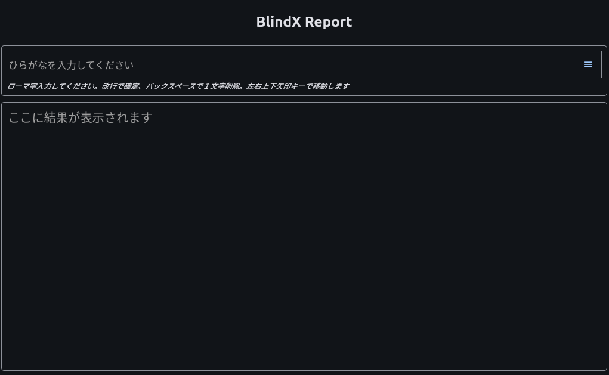

# BlindX Report

## 実行方法

```
cd BlindX-pub/demo-25.02/apps
flet app2
```

<p align="center">
    
</p>

プログラムが起動したら上段のミニバッファのひらがな文が下段に反映されます。
キーバインドは emacs/readline に準拠しています。

| キー    | 動作           |
|--------|----------------|
| Ctrl-P | 上の行へ移動     |
| Ctrl-N | 下の行へ移動     |
| Ctrl-A | 行の先頭に移動   |
| Ctrl-E | 行の末尾に移動   |
| Ctrl-F | 右へ移動        |
| Ctrl-B | 左へ移動        |
| Ctrl-H | 直前の文字を削除 |
| Ctrl-D | 現在の文字を削除 |
| Ctrl-M | 改行           |

特殊キーは以下のように Ctrl キーにマップされます。

```
special_keys = {
    'Page UP':'P', 
    'Page Down':'N', 
    'Home':'A', 
    'End':'E', 
    'Arrow Right':'F', 
    'Arrow Left':'B', 
    'Arrow Up':'P', 
    'Arrow Down':'N', 
    'Delete':'D', 
    'Backspace':'H', 
    'Enter':'M', 
    'Zenkaku Hankaku':'`', 
} 
```


この例ではキーボードの直接の入力を捕獲しています。日本語キーボード配置のマップを使用しています。


