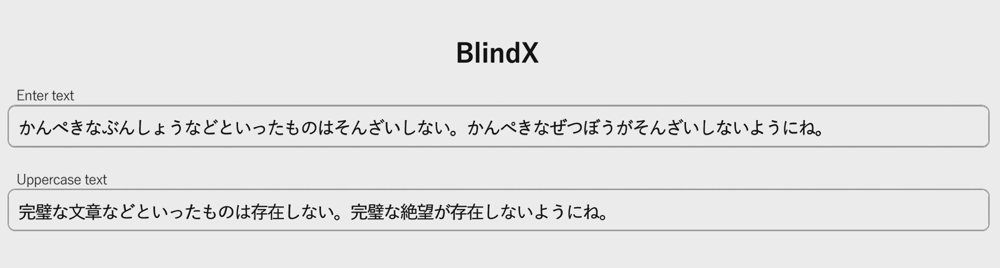

# BlindX

<p align="center">
    
</p>

BlindX は、Transformer T5 (Text-to-Text Transfer Transformer) の推論機能を活用した日本語入力フロントエンドであり、
AI の柔軟な日本語生成機能を活かして、コンピュータとの快適な対話環境を提供します。
推論処理は、GPU を搭載した専用サーバを介して実行されます。
これにより、入力の障壁の少ないエッジクライアントの構築を目指します。

ここでは主な処理の流れを説明します。
コードの詳細はリポジトリをご参照ください。

# サーバとの通信

BlindX サーバとの基本的な通信は、単純な WebSocket ベースの非同期 Echo サーバです。
クライアントがひらがな文を送信すると、対応するかな漢字文が返信されます。


```python
import asyncio
while self.websocket:
    try:            
        if text:
            await self.websocket.send(dict_type + text)
            return await self.websocket.recv()
        else:
            return ''
    except websockets.ConnectionClosed:
        await self.websocket.close()
        self.websocket = await websockets.connect(self.uri)
```

サーバでの変換は、各スレッドごとにひとつの `send()` に対して対応する `recv()` で完結し、ステートレスで行われます。
すなわち、サーバ側はクライアントの過去の状態を保持しません。

変換に際して、辞書の指定や前後の文脈などのコンテクストは、その都度再送信されます。

# 辞書の選択

変換にあたっては、異なるコーパス（語彙データベース）から学習した複数の辞書から適切なものが選択されます。


辞書の一例として以下のものがあります。

| 辞書名 | 下敷きとしたコーパス |
|-------|----------------|
| aozora256 | 青空文庫コーパス |
| wiki256 |  wikipedia コーパス |
| 2ch256 |  おーぷん２ちゃんねる対話コーパス |
| cc256 |  CC-100 コーパス |

これらの辞書は個人ごとというよりむしろ、それぞれの対象領域の語彙集合が時代とともに変化するのに合わせて更新されます。
辞書の選択は多くの場合アプリケーションの特性に応じて選ばれ、最終ユーザが意識することはありません。

# 変換の実際

## プリプロセッサ

BlindX の入力は、字句解析前の日本語ひらがなです。
ただし、ユーザーにとってはひらがな入力が直接のインターフェースとなるわけではありません。

デスクトップではキーボードによるローマ字入力、モバイルではフリック入力、あるいは音声・ジェスチャ入力など、入力手段（モーダル）は異なります。
そのため、BlindX ではモーダルごとに異なるプリプロセッサを配置しています。

<pre>

+-------------+  +------------------+
| Flick Input +--+ Error correction + ------------------------+
+-------------+  +------------------+                         |
                                                              |
+-------------+  +------------------+ +--------------------+  |
| keyboard    +--+ Error correction +-+ romaji-to-hiragana +--+-- Hiragana - BlindX
+-------------+  +------------------+ +--------------------+  | 
                                                              |
+-------------+  +-----------------+ +------------------+     |
| Audio input +--+ speech-to-text  +-* error correction +-----+
+-------------+  +-----------------+ +------------------+

</pre>

デスクトップアプリでは、キーボードのローマ字入力をひらがなに変換する部分がこれに該当します。

> blindX のローマ字変換
> blindX のデフォルトのローマ字ひらがなパーサはいくつか拡張がされています。
> いくつかは既存の IME との相互運用を容易にするためのものです。
> - 半角英数字も一旦全角英数字に変換されます
>   - **2025ねん1がつ１にち** → **２０２５ねん１がつ１にち**
> - はじめからかな漢字のものはひらがなのまま出力されます
>   - **ashitanotenkiは晴れdatoomou** -> **あしたのてんきは晴れだとおもう**
> - バッククォートされた範囲は半角ローマ字のまま出力されます。
>   - **\`Hey Jude\` habi-toruzunogakkyokudesu** -> **Hey Jude はびーとるずのがっきょくです**

加えて、必要に応じてそのモーダル特有でおこりがちな誤入力を修正する推論器が挿入されます。

## ライブ変換

変換にあたっては、最短で1文字入力されるたびに、変換要求が即座に発行されます。
この間隔は調整できます。

実際に変換が行われるかどうかは、ユーザのキーボードの入力速度およびその時点でのサーバのレイテンシによって判断されます。
例えば、キーボードの入力が十分遅いとき、「あしたのてんきははれだとおもう」の入力は、

| 入力   | 変換 |
|--------|-----|
|あ | あ |
|あし | 足 |
|あした | 明日 |
|あしたの | あしたの |
|あしたのて | 明日のて |
| | |
|あしたのてんきははれだとおもう | 明日の天気は晴れだと思う |

のように変換が進行します。

実際は、サーバへの変換要求の送信は一つ前の変換の返答が完了するまでペンディングされます。
それまでは入力されたひらがなが、最後に変換されたかな漢字文の末尾にそのまま追加されます。
そして、次の変換が確定した時点で、文字列は最新のかな漢字に変更されます。

この段階では変換は応答性を優先して、狭いウィンドウでの変換が行われます。より正確な変換は長いウィンドウで再度実行されます。
つまり変換は文脈のウィンドウをかえて複数回実行されることになります。

## 文章の訂正と校正

一旦確定した文章の修正には打ち間違いによる誤変換などの小規模なものと、より広い文脈を見た上でのものがあり、ここでは
前者を訂正、後者を校正と呼びます。

### 訂正

軽微な訂正は BlindX ができるだけ自動的に訂正することを試みます。
この場合はユーザは訂正があったこと自体を意識しません。

それでも失敗した修正は、通常の日本語変換と同じく、特定の部分のの候補を選択し再変換します。
つまり推論器は対応する形態素の推定結果を与えらた語句に固定した状態で、再度推論を試みます。
このため、一箇所を修正するとその周辺も自動的に変更されることもあります。

### 校正

より広い校正は、すでに一旦かな漢字が確定した以前の内容まで遡って再度翻訳単位に含めることで行われます。
推論器は前後の文章を反映して入力精度の向上を図ります。
これは会話文の羅列のような短い断片的な文が続くケースでは有効に作用します。

校正処理は入力の明確な区切りである句点や改行の時点で実行が試みられます。
ユーザからの入力が一旦途絶えたタイミングでも自動的に走査が実行されます。

以下に例を示します。（ただし、説明のため極端に短い間隔で改行しています）

| 一旦確定した入力 | 変換に参照されるウィンドウ | 
|------------|------------------------|
|しかもあとできくと | しかもあとできくと |
|しょせいという | しかもあとできくと + しょせいという |
|よのなかでもっとも | しかもあとできくと + しょせいという + よのなかでもっとも |
|どうあくないきものだそうだ | しかもあとできくと + しょせいという + よのなかでもっとも + どうあくないきものだそうだ |

実際の日本語変換は、この間に低レイテンシの短いウィンドウでの変換が間に挟まれます。
したがって上記の例では最小で以下の順番で変換されます。

| 入力 | その時点で確定した文 |
|------------|---------|
| しかもあとできくと | しかも後で聞くと |
| しょせいという | 処世という |
| しかもあとできくとしょせいという | 書生という |
| よのなかでもっとも| 世の中で最も |
| しかもあとできくとしょせいというよのなかでもっとも | 世の中で最も |
| どうあくないきものだそうだ | どうあくな生き物だそうだ |
| しかもあとできくとしょせいというよのなかでもっともどうあくないきものだそうだ | 獰悪ないきものだそうだ |

最後の変換結果は遡ってそれ以前の結果にも反映されることもあります。
ただし、実際は参照するウィンドウ自体も入力が進むにあわせてスライドします。
そのため、どの段の候補が採用されるかはその位置によって異なります。

### 広範囲な校正（オプション）

グループウェアやチャットのように複数の書き手がひとつの流れの文章を共同で構成していくケースでは
全員分のコンテキストを保持しておいて、広範な範囲で blindx のサーバで変換・編集をかけることが可能です。
各メッセージを時系列でマージして長いチャンクとして変換をかけることでより文脈に即した変換が期待できます。

# ショーケースとベストプラクティス

ここで紹介した機能を実装した MIT ライセンスのショーケースコードが GitHub にあります。詳細はリポジトリをご参照ください。
ここでのコードにはいくつかの制限事項があります。

## BlindX の使用形態

BlindX の主なユースケースとして、
- BlindX FEP (Front End Processor) を経由するもの
- スタンドアロンアプリ
- Web アプリ

が考えられますが、ここでのショーケースではサーバサイドアプリケーションを前提としています。
スダンドアローンアプリとして実行する場合は若干の変更が必要になります。詳細はレポジトリを参照ください

※BlindX FEP については将来別途リリース予定です。

### FEP を経由する場合
通常の IME と同じになります。ユーザの入力コンテクストやログはローカルの FEP の中のみで閉じて蓄積され最終的に変換された
日本語だけがアプリケーションに渡されます。あるいは BlinX の通信のみを使って独自の FEP をサービスごとに実行する方法も
あります。

### Web App
Web アプリでは WSGI/ASGI など非同期な Web サーバが一般的に使われます。
この場合、BlindX は直接クライアントと通信をするのではなくて、Web サーバと BlidX サーバの間で行なうことが考えられます。

### スタンドアロンアプリ
スタンドアロンのアプリの場合、BlindX サーバとの通信は認証が完了したのちクライアントとの直接通信になります。
また異なるクライアントからの入力を文脈に含めるため、共有機構が別途必要なります。

## 入力の反映方法

ユーザの入力の反映には
- 一旦フレームワークで用意されたテキストボックスういジェットにエコーされた文字列をフックして内容を動的に書き換える方法と、
- 低レベルのキーボード入力やマイク入力を捕獲する方法

があります。ショーケースでは２つの方法のいずれかが実装されています。

## スレッドと asyncio

blindx websocket 通信を  UI のバックグラウンドで行うのには asyncio とスレッドのいずれを使うこともできます。
可能な環境であれば asyncio ではなくスレッドを使うほうがサーバのコストを少なく素早い反応が期待できます。
変換処理自体は非常に軽量なためマシンあたり多くのリクエストを管理できます。そこで入力頻度が低い場合などで
入力が中断しているセッションは一旦接続を解除し、より多くの同時接続を試みることができます。この場合には
UI と同じイベントループで send()/recv() を行うよりは別スレッドのほうが有利となります。

## ショーケースで使用している UI フレームワーク

ショーケースの UI フレームワークには [Flet](https://flet.dev/) を採用しています。

## Compare

実際の日本語変換機能の基本テストを行います。
[mozcpy](https://github.com/ikegami-yukino/mozcpy) を用いた変換結果と比較できます。

<p align="center">
   <video src="./screenshots/scompare2.mp4" controls="true" width="640"></video>
</p>

詳細とソースコードは github を参照ください

## Real-time Chat

非同期なリアルタイムチャット

共有された広い範囲の文脈を使ったメッセージングアプリの例です。
日本語変換のリアルタイム性とあいまって、より音声会話に近い感覚でテキスト会話が可能になります。

<p align="center">
   <video src="./screenshots/schat2.mp4" controls="true" width="480"></video>
</p>

詳細とソースコードは github を参照ください

## On-line Edit

パラグラフにまたがった広範囲の日本語変換をおこなったテキストエディタです。
またより低レベルのキーボード入力をハンドルしている例にもなっています。
最初のキーバインドは linux でのデフォルトの readline/emacs のキーバインドに沿っています。

<p align="center">
   <video src="./screenshots/report4.mp4" controls="true" width="640"></video>
</p>

詳細とソースコードは github を参照ください

## この記事について

“BlindX” is a registered trademark of AXTech.Care Inc.

Our latest technology related to BlindX is currently pending patent approval, and we are actively working to protect our intellectual property.

「BlindX」は AXTech.Care Inc. の登録商標です。
当社の BlindX に関連する最新技術は現在特許出願中であり、当社は知的財産の保護に努めてまいります。


